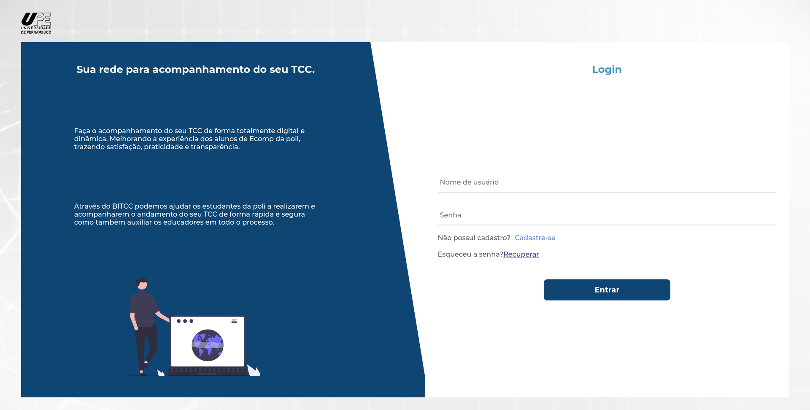
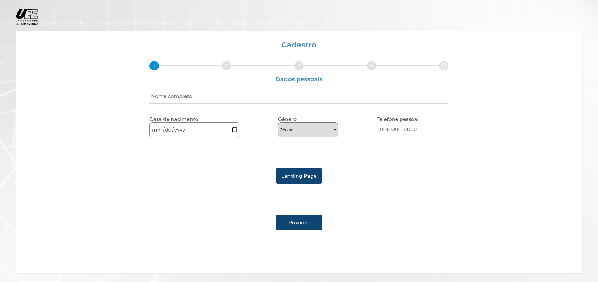
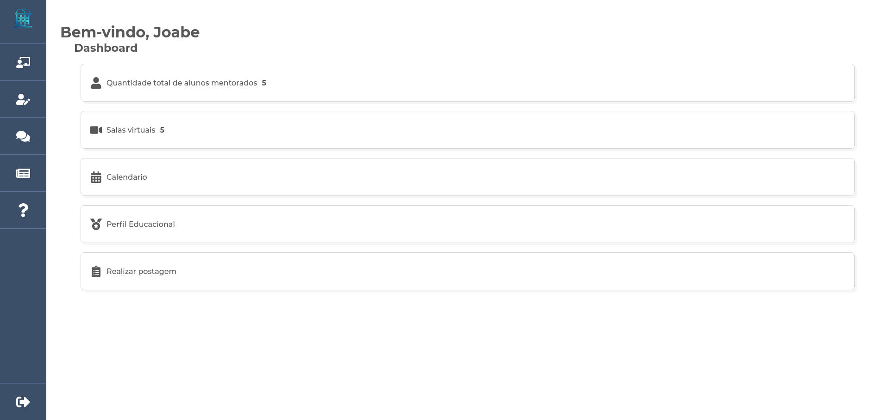

<h1 align="center">BITCC</h1>
<p align="center">🚀 Integrated Course Completion Work Base.</p>

<h4 align="center"> 
	Concluido ✅
</h4>
<div align="center">
  
  
  
  
</div>

### Pré-requisitos

Antes de começar, você vai precisar ter instalado em sua máquina as seguintes ferramentas:
[Git](https://git-scm.com), [Node.js](https://nodejs.org/en/).
Além disto é bom ter um editor para trabalhar com o código como [VSCode](https://code.visualstudio.com/)


### 💻 Rodando o Front End (Web)

```bash
# Acesse a pasta do projeto no terminal/cmd
$ cd desafio-salvus

# Vá para a pasta frontend
$ cd frontend

# Instale as dependências
$ yarn

# Execute a aplicação em modo de desenvolvimento
$ yarn start

# O frontend inciará na porta:3000 - acesse <http://localhost:3000>
```

### 🛠 Tecnologias

As seguintes ferramentas foram usadas na construção do projeto:

- [Node.js](https://nodejs.org/en/)
- [React](https://pt-br.reactjs.org/)
- [TypeScript](https://www.typescriptlang.org/)

### Autor

---

<a href="https://blog.rocketseat.com.br/author/thiago/">
 
 <br />
 <sub><b>Davyson Melo</b></sub></a>

[![Twitter Badge]
[![Gmail Badge]
