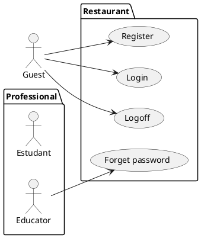

# Relatorio de Especificacoes de casos de uso do SITCC

## Engenharia de Sofware - turma ES

### Integrantes
- Lucas Hellanio

## Requisitos Funcionais

### Lista de Requisitos Funcionais

- RF01 - Cadastrar
- RF02 - ??????
- RF03 - ?????
- RF04 - ?????
- RF05 - ?????
- RF06 - ?????
- .....

### Diagrama de Casos de Uso

### Especificicações de Casos de Uso

- [RF01](DOC/reqs_RF01.md)
- [RF02](reqs_RF02.md)
- [RF03](reqs_RF03.md)
- [RF04](reqs_RF04.md)
- [RF05](reqs_RF05.md)
- ....

## Requisitos não-funcionais

### Usabilidade

... Segundo ... Autor ...

## Referências

[1] Autor ...

[2] Autor ...

[3] React ...

[4] PlantUML ...

