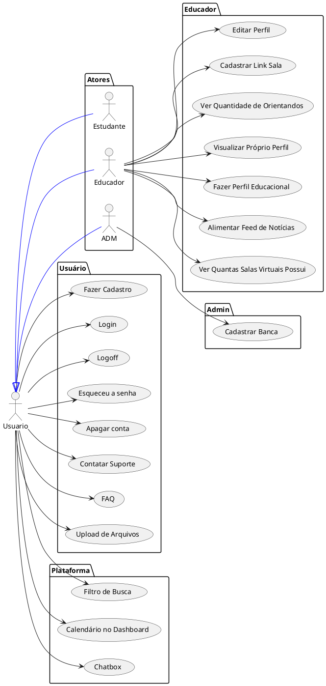

# Relatorio de Especificacoes de casos de uso do BITCC

## Engenharia de Sofware - turma ES

### Integrantes
- Bruna Lins
- Lucas Hellanio
- Pedro Gabriel Lima
- Silas Nunes

## Requisitos Funcionais

### Lista de Requisitos Funcionais

- RF01 - Cadastrar
- RF02 - Login
- RF03 - Logoff
- RF04 - Deletar Conta
- RF05 - Esqueci a senha
- RF06 - Contatar Suporte
- RF07 - FAQ
- RF08 - Upload de Arquivos
- RF09 - Cadastrar Banca
- RF10 - Editar Perfil
- RF11 - Cadastrar link da sala virtual.
- RF12 - Ver Quantidade de Orientandos
- RF13 - Visualizar o Próprio Perfil
- RF14 - Fazer Perfil Educacional
- RF15 - Alimentar Feed de Notícias
- RF16 - Ver Quantas Salas Virtuais Possui
- RF17 - Filtro de Busca
- RF18 - Calendário no Dashboard
- RF19 - Chatbox

### Diagrama de Casos de Uso

### Especificicações de Casos de Uso

- [RF01](UseCaseSpecifications/reqs_RF01.md)
- [RF02](UseCaseSpecifications/reqs_RF02.md)
- [RF03](UseCaseSpecifications/reqs_RF03.md)
- [RF04](UseCaseSpecifications/reqs_RF04.md)
- [RF05](UseCaseSpecifications/reqs_RF05.md)
- [RF06](UseCaseSpecifications/reqs_RF06.md)
- [RF07](UseCaseSpecifications/reqs_RF07.md)
- [RF08](UseCaseSpecifications/reqs_RF08.md)
- [RF09](UseCaseSpecifications/reqs_RF09.md)
- [RF10](UseCaseSpecifications/reqs_RF10.md)
- [RF11](UseCaseSpecifications/reqs_RF11.md)
- [RF12](UseCaseSpecifications/reqs_RF12.md)
- [RF13](UseCaseSpecifications/reqs_RF13.md)
- [RF14](UseCaseSpecifications/reqs_RF14.md)
- [RF15](UseCaseSpecifications/reqs_RF15.md)
- [RF16](UseCaseSpecifications/reqs_RF16.md)
- [RF17](UseCaseSpecifications/reqs_RF17.md)
- [RF18](UseCaseSpecifications/reqs_RF18.md)
- [RF19](UseCaseSpecifications/reqs_RF19.md)

## Requisitos não-funcionais

### Usabilidade

- O sistema de Atendimento a Clientes será construído para rodar em ambiente web. Deverá possui um design responsivo
- Os usuários poderam operar no sistema de forma independente.

### Confiabilidade

- o sistema deverá ter alta disponibilidade

## Referências

[1] [PlantUML](https://plantuml.com/)
