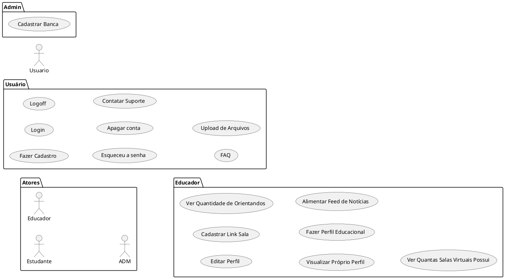

# Relatorio de Especificacoes de casos de uso do SITCC

## Engenharia de Sofware - turma ES

### Integrantes
- Bruna Lins
- Lucas Hellanio
- Pedro Gabriel Lima
- Silas Nunes

## Requisitos Funcionais

### Lista de Requisitos Funcionais

- RF01 - Cadastrar
- RF02 - Login
- RF03 - Logoff
- RF04 - Deletar Conta
- RF05 - Esqueci a senha
- RF06 - ?????
- RF07 - FAQ
- RF08 - ?????
- RF09 - ?????
- RF10 - Editar Perfil
- RF11 - ?????
- RF12 - ?????
- RF13 - Visualizar o Próprio Perfil
- RF14 - ?????
- RF15 - ?????
- RF16 - ?????
- RF17 - ?????
- RF18 - Calendário no Dashboard
- RF19 - Chatbox
- .....

### Diagrama de Casos de Uso

### Especificicações de Casos de Uso

- [RF01](UseCaseSpecifications/reqs_RF01.md)
- [RF02](UseCaseSpecifications/reqs_RF02.md)
- [RF03](UseCaseSpecifications/reqs_RF03.md)
- [RF04](UseCaseSpecifications/reqs_RF04.md)
- [RF05](UseCaseSpecifications/reqs_RF05.md)
- ....

## Requisitos não-funcionais

### Usabilidade

... Segundo ... Autor ...

## Referências

[1] Autor ...

[2] Autor ...

[3] React ...

[4] PlantUML ...

